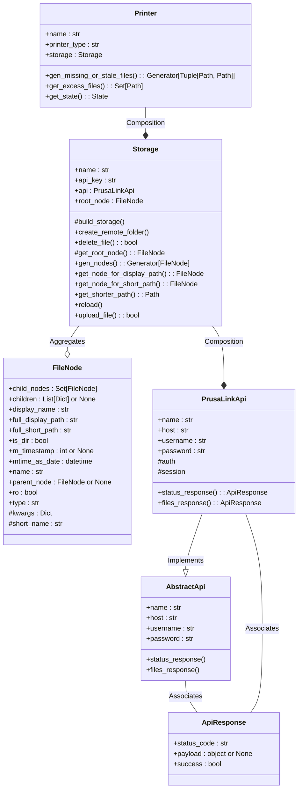

# Link Sync

## Purpose

The goal of this project is to sync gcode files from a local "master" directory
to any number of Prusa printers on the local network running PrusaLink when
they are idle, simultaneously.

Transfering files is tediously slow, so the idea is to sync several printers
all at once. This is a powerful workflow for farm operators who may have a
new model that replaces an older one and negates the need to send it
individually to every printer, or, to manually fetch their USB stick/other
to for updating at your local machine.

Also, by removing files that aren't in the local "master" directory, once off
prints are automatically cleaned up from a printer's USB stick.

## Theory of Operation

Locally, a "master" file structure is maintained containing all the GCode files
required at the target machines. Also, configuration file in either YAML or
JSON format is kept on the local machine that contains the connection details
for each printer.

The program reads the configuration file, instantiates printer instances, then
for the printers that aren't currently busy, a thread is spawned which is
responsible for check what files should be deleted from the printer, or copied
to the printer to bring it into sync with the local "master" file-structure.

These threads then operate simultaneously to bring all idle printers into sync
at roughly the same time.

Note that PrusaLink running on the printer refuses to delete a file that is
actively being printed. This is a good thing.

Being a command-line program, it would be easy to set up with `cron` to run
every hour on the hour from 7pm to 7am (overnight) to ensure that all printers
get synced/cleaned up from the previous day's run and ready to go for the
next day.

## Currently Implemented Features

Printers currently supported:

- [x] Prusa MK4 running firmware 5.0.0 RC1

TODO:

- [ ] Prusa XL
- [ ] Prusa Mini
- [ ] Prusa MK3

Features:

- [x] Add new files that were found in local source but not in remote storage.
- [x] Delete excess files not found in local source but are in remote storage.
- [x] Optionally operate on printers that are not idle.
- [x] Replace stale files that have a modification date more recent (> 60 sec.)
      than the same file on the remote storage.

TODO:

- [ ] Optionally, copy files that exist on a printer that are unique back to
      the local filesystem.

## Program Structure

### The `__main__` module

There is certain UI-related work performed in the `link_sync` package's
`__main__` module including the reading of a configuration file to instantiate
`Printer` instances. It is also here that a scan of the local "master"
filesystem is performed before a thread-pool is created to operate on as many
printers as there are local CPU cores at a time.

The primary entry point is the `process()` function which manages reading the
local "master" file-structure and managing the pool of threads which all run
a `_sync()` function.

### The `Printer` class

This represents a single printer instance. The printer will instantiate a
`Storage` instance on initialization, passing in all the credentials required
for an API instance.

### The `Storage` class

The Storage class manages its own `PrusaLinkApi` instance the collection of
files that are all linked to the `root_node` of the Printer's storage. For
example, on Prusa MK4 printers, this is an object with the name `usb`. From
here, further FileObjects are linked as `child_nodes`, and so on representing
the whole file-system.

Any given file references its parent in `FileNode` `parent_node` and
directory ("FOLDER") objects contain their children as a set of `FileNode`s
in `child_nodes`.

### The `FileNode` class

This represents a single object on the remote storage. However, FileNode
instances are not natively, but can be doubly linked together by logic in the
`Storage` class.

### The `PrusaLinkApi` class

This is a class that subclasses the abstract `AbstractApi` class. THe idea is
that other types of APIs could also implement the required methods of the
`AbstractApi` in the future (`AbstractApi` should probably be a Python
Protocol instead).

The `PrusaLinkApi` implements the required methods specifically for PrusaLink
0.7.0 which is under fairly rapid development/evolution.

Although this will likely change in the near future, the only required methods
are to handle requests to PrusaLink's `files` and `status` endpoints using
various HTTP verbs (GET, PUT, and DELETE, specifically.)

### The `ApiResponse` class

This is a small data class to hold an API response's status_code and
deserialized JSON payload with some helper methods.

Copyright (c) 2023, Martin Koistinen
